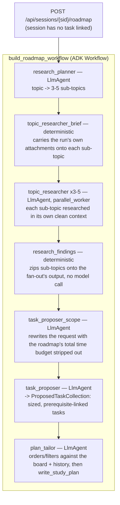

# Runway Compass

An adaptive agentic coach that turns your technical goals into bite-sized tasks, prepares
the material for the next one while you're away, and adjusts how it guides you as it
learns how you think.

**[Live app](https://coach-api-pwh2ad5axa-uc.a.run.app)** — sign-in is required, and
email/password accounts are created by an operator rather than self-service sign-up.

![The task workspace. On the left, the task "Intermediate Data Structures and Comprehensions" with a 25-minute estimate and a two-item checklist: a completed 10-minute docs reading, and a 15-minute exercise marked "with your coach". On the right, the learner has sent a list comprehension and the task_teacher has replied "Spot on! That extracts ['auth-service', 'notification-service', 'analytics-service'] cleanly and idiomatically", then moved to step 2 and asked how they would write a dictionary comprehension to build an id-to-name lookup map.](docs/images/coach-guided-exercise.png)

*Working through a guided exercise. The coach checks the learner's answer, then asks the
next question instead of supplying it. The checklist on the left is the task's definition of
done — the coach researched and proposed it as part of a roadmap for the whole project.*

## What it does

- Organizes work into **projects** and ordered, duration-estimated **tasks**; splits
  anything too big into bite-sized subtasks.
- Runs a **Socratic session** per task: understands uploaded work (text, PDF, images),
  asks rather than tells, and adapts to your preferences.
- Splits the conversation in two. A **project coach** owns the board — it proposes, splits,
  and reorders tasks, and asks before discarding anything. A **task teacher** owns one
  task's checklist, and has no tool that could put new work on the board instead of in
  front of you.
- Keeps a **learner model** across sessions plus **per-project preferences** — a 45-minute
  default task length globally, 2 hours in the project where you want it. You can read,
  edit, and reset what it believes about you under "What your coach knows about you" in
  Settings.
- Does **autonomous research** on a schedule: finds articles, exercises, and
  duration-checked videos for your next task, and clearly separates what's needed to
  finish the task from optional extras.
- Builds a **roadmap** for a whole project from one sentence: a fan-out of parallel research
  agents proposes sized, prerequisite-linked tasks, then a tailoring step orders and filters
  them against the existing board and the learner's own history before writing anything.
- Long work runs **in the background**. A research or roadmap run is queued rather than tied
  to your connection, so it survives you closing the tab and resumes across instances.
- Never interrupts you: background work skips any project you're currently working in.

## Stack

| Layer | Choice |
| --- | --- |
| Model | `gemini-3.7-flash` (Vertex AI), multimodal, fall-back to `gemini-3.5-flash-lite` for budget-friendly dev |
| Agents | Google ADK — interactive coach, scheduled research workflow |
| Backend | Python 3.12, FastAPI, WebSocket streaming, Cloud Run (dev tooling: `uv`, `ruff`) |
| Data | Firestore (domain + ADK sessions + memory), GCS for artifacts |
| Frontend | Vite, React, TypeScript, React Router, TanStack Query + Zustand, Tailwind + shadcn/ui — built into the API container and served at the same origin |
| Auth | Cloud Identity Platform, Google sign-in + email/password (only admin managed, no user signups with email/password) |
| Infra | Terraform, Cloud Scheduler + Cloud Tasks, GitHub Actions |
| Tests | pytest + gcloud Firestore emulator, Vitest, Playwright |

See [07-infra-deploy.md](docs/07-infra-deploy.md) for the toolchain a dev machine needs.

## Architecture


One Cloud Run service, `coach-api`, runs everything. That is mostly a choice about IAM:
splitting the REST API, the WebSocket, and the scheduler endpoints into separate services
means three sets of bindings to debug while the design is still moving. It serves the built
React SPA, the `/api` REST surface, and a `/ws` WebSocket from one origin, plus an
OIDC-only `/internal/*` surface that only the scheduler and task-queue service accounts can
call.

| GCP service | What it's doing here |
| --- | --- |
| **Cloud Run** | `coach-api` — SPA, REST, WebSocket, and the internal scheduler/task endpoints, one container |
| **Vertex AI** | Gemini 3.7 Flash for every agent turn, IAM-authenticated in production — no API key to rotate |
| **Firestore** | Domain data (projects, tasks, sessions) *and* ADK's own session/event store and long-term agent memory, one native-mode database |
| **Cloud Storage** | A staging bucket for signed-PUT uploads (1-day TTL) and a durable bucket for finalized artifacts |
| **Cloud Scheduler + Cloud Tasks** | A `*/15 * * * *` tick queues per-project autonomous research runs, so a run survives both the tab closing and the instance scaling to zero |
| **Identity Platform** | Google sign-in and admin-issued email/password accounts |
| **Cloud Functions (1st gen)** | `blockSignup`, a `beforeCreate` blocking function that rejects self-service email/password sign-up |
| **Terraform + GitHub Actions** | The whole stack above is `terraform apply` from zero (two one-time human steps — see [Deploying to GCP](#deploying-to-gcp)); every push to `main` builds and deploys via Workload Identity Federation, no service-account keys |

See [01-architecture.md](docs/01-architecture.md) for the request-path detail and
[07-infra-deploy.md](docs/07-infra-deploy.md) for the full resource list and IAM bindings.

## Agents, tools, and the roadmap workflow

Gemini 3.7 Flash does the reasoning; ADK's `Workflow` decides what runs when. What the
coach leans on:

- Every change to the board — proposing tasks, completing one, filing a research report,
  writing a study plan — arrives as a **function call** landing in `services/`, the same
  call path a user's own button in the UI takes
  ([layering inside `coach-api`](docs/01-architecture.md#layering-inside-coach-api)).
- **Structured output** (`output_schema`) on every node below: `research_planner` returns a
  typed sub-topic list, `topic_researcher` a typed findings object, `task_proposer` a typed
  `ProposedTaskCollection`. Nothing downstream re-parses free text.
- **Multimodal input** survives the whole pipeline. A learner's uploaded screenshot, PDF, or
  rubric rides into the run as a content part and is threaded onto every parallel research
  branch below, so a sub-topic that mentions "the attached rubric" can actually read it.
- **Reasoning depth is set per call** (`thinking_level`): `low` for mechanical steps like
  task splitting, `high` for research synthesis and the Socratic intake conversation.
- The fan-out below runs **3-5 Gemini calls concurrently**, each driving its own tool loop
  over `search_agent`, `fetch_url`, and `youtube_find_by_duration`.

**ADK's `Workflow`** is the orchestration primitive behind all of that: a directed graph of
nodes — each either an `LlmAgent` turn or a plain deterministic function — sharing one ADK
session. `build_roadmap_workflow`
(`apps/api/src/coach/agents/research_workflow.py`) is the graph a whole-project ask runs —
`POST /api/sessions/{sid}/roadmap`, on a session that isn't linked to any task:



Two constraints behind that ordering:

- **The chain is strictly sequential.** `task_proposer_scope` reads the original request,
  same as `research_planner` does, but it sits *after* the `topic_researcher` fan-out.
  ADK's `Workflow` feeds each node's output to the next node in the edge list as that
  node's own `node_input`, so a node placed *between* `research_planner` and the fan-out
  would silently *become* the fan-out's input in place of a sub-topic, collapsing 3-5
  parallel branches into one. Nothing raises at construction time. The ordering is
  load-bearing.
- **`task_proposer_scope` strips information out.** It rewrites the roadmap request with the
  learner's total time budget removed, so `task_proposer` sizes each task against the
  per-sitting preference alone; only `plan_tailor`, at the very end, judges whether the full
  set of tasks fits the time the learner actually has.

See [03-agent-design.md](docs/03-agent-design.md#the-research-pipeline-since-m9) for the
rest of the pipeline, including the task-scoped `research_workflow` this one shares its
planner and fan-out with.

## Documentation

Start with [`docs/00-overview.md`](docs/00-overview.md) — it carries the scope decisions and
the eight design choices everything else follows from.

| Doc | Contents |
| --- | --- |
| [00-overview.md](docs/00-overview.md) | Product shape, v1 scope, key decisions, model config |
| [01-architecture.md](docs/01-architecture.md) | Components, layering, repo layout, request paths |
| [02-data-model.md](docs/02-data-model.md) | Firestore collections, task state machine, ordering, indexes |
| [03-agent-design.md](docs/03-agent-design.md) | ADK agent graph, tool catalogue, custom Firestore services, learner model |
| [04-api-contract.md](docs/04-api-contract.md) | REST + WebSocket protocol, auth, disconnect/resume semantics |
| [05-autonomous-runs.md](docs/05-autonomous-runs.md) | Scheduler, job ledger, leases, presence guard, recovery |
| [06-frontend.md](docs/06-frontend.md) | Routes, state split, board and workspace UI, theming |
| [07-infra-deploy.md](docs/07-infra-deploy.md) | Terraform, Cloud Run config, CI/CD, local dev |
| [08-testing.md](docs/08-testing.md) | Test strategy, contract suites, golden e2e flows |
| [09-roadmap.md](docs/09-roadmap.md) | Build order, what each stage decided, deferred items |
| [10-risks.md](docs/10-risks.md) | Risks, mitigations, open questions |

## Getting started

```bash
./scripts/dev.sh doctor    # check the machine prerequisites
./scripts/dev.sh up        # Firestore emulator + API + Vite
./scripts/dev.sh seed      # a demo user, project, and tasks
./scripts/dev.sh test      # api (pytest + emulator), web (vitest), e2e (Playwright)
./scripts/dev.sh lint      # ruff, mypy, eslint, prettier, tsc, terraform fmt
```

See [07-infra-deploy.md](docs/07-infra-deploy.md#prerequisites) for the toolchain, and
[infra/terraform/RUNBOOK.md](infra/terraform/RUNBOOK.md) for the two manual bootstrap
steps each environment needs before its first `terraform apply`.

## Deploying to GCP

Everything in [Architecture](#architecture) is `terraform apply` from zero, except two
one-time, human steps per environment — enabling Identity Platform via the Cloud
Marketplace, and creating the OAuth 2.0 web client and consent screen. Both are walked
through screen-by-screen in [infra/terraform/RUNBOOK.md](infra/terraform/RUNBOOK.md)
(§1–2); this is the short version, for a brand-new environment:

```bash
# one-time per environment — RUNBOOK.md §1-2
#   1. enable Identity Platform (Cloud Marketplace)
#   2. create the OAuth 2.0 web client + consent screen

cd infra/terraform/envs/dev
terraform init -backend-config=backend.hcl

# Cloud Run needs a real image and the image needs a registry this stack creates,
# so the first apply is targeted just at the registry:
terraform apply -var-file=dev.tfvars -target=google_artifact_registry_repository.images

PROJECT=YOUR_PROJECT_ID
IMAGE="us-central1-docker.pkg.dev/$PROJECT/coach/coach-api:bootstrap"
gcloud auth configure-docker us-central1-docker.pkg.dev --quiet
docker build -t "$IMAGE" .
docker push "$IMAGE"

terraform apply -var-file=dev.tfvars -var="image=$IMAGE"   # run twice — see RUNBOOK.md §3
```

After that first apply, replacing the placeholder secret values (RUNBOOK.md §4) and
wiring up GitHub Actions (§6) are the last manual steps — from then on, `git push` to
`main` is the whole deploy: `deploy-cloudrun.yml` builds and deploys the image via
Workload Identity Federation, no service-account keys involved. See
[07-infra-deploy.md](docs/07-infra-deploy.md) for the CI/CD detail and
[infra/terraform/RUNBOOK.md](infra/terraform/RUNBOOK.md) for the full walkthrough,
including the verification checklist that closes it out.
